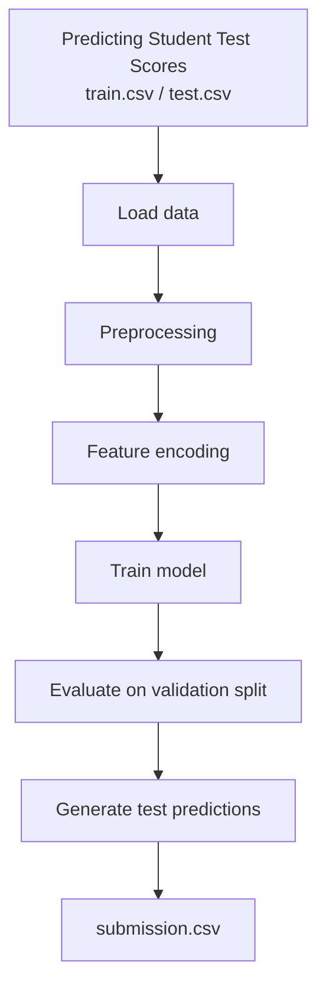

# Predicting Student Test Scores

```md
## ML pipeline



## Dataset

## Quickstart

```bash

git clone https://github.com/wmeikle33/Predicting-Student-Test-Scores-Repo.git
cd Predicting-Student-Test-Scores-Repo
python -m venv .venv
source .venv/bin/activate
pip install -e ".[data]"
python scripts/download_data.py

## Training different models

### Linear regression baseline

pip install -e .
test_scores-train --csv data/raw/train.csv --label exam_scores --model linreg --model-path models/linreg.joblib

### XGB regression

```


## Project Structure

```bash

Predicting-Student-Test-Scores/
├── pyproject.toml
├── pre_commit_config.yaml
├── requirements.txt
├── requirements-dev.txt
├── src/
│   └── test_scores/
│       ├── __init__.py
│       ├── model.py
│       ├── train.py
│       ├── predict.py
│       └── data.py
├── scripts/
│   ├── train.py
│   └── predict.py
├── reports/
├── notebooks/
└── tests/


```

## Results

| Model | MAE | RMSE | R² |
|---|---:|---:|---:|
| Linear Regression | TBD | TBD | TBD |
| Ridge Regression | TBD | TBD | TBD |
| Random Forest | TBD | TBD | TBD |
| XGBoost Regressor | TBD | TBD | TBD |
